# WHMCS SSL module - Installation, configuration and management

Openprovider SSL module allows you to resell our SSL Certificates through your WHMCS website.

## Requirements

1. WHMCS versions - 7.x.x to latest
2. PHP 7.4 or above
3. Openprovider reseller account

## How to upload the files?

1. Download the module file. Extract the zip file on your computer.
2. Connect to the server where WHMCS is installed via your web hosting control panel (cPanel/Plesk/Webmin, etc.) or via FTP.
3. Go to the extracted folder `modules/addons/openprovider_ssl` and upload the folder `openprovider_ssl` into `<WHMCS_ROOT>/modules/addons/`
4. Go to the extracted folder `modules/servers/openprovider_ssl` and upload the folder `openprovider_ssl` into `<WHMCS_ROOT>/modules/servers/`
5. Go to the extracted folder `crons` and upload the file `priceSync.php` into `<WHMCS_ROOT>/crons/`

## Configure the addon module

1. Log in to your WHMCS admin area. Go to **System Settings** >> Find **Addon Modules** and click on it.

   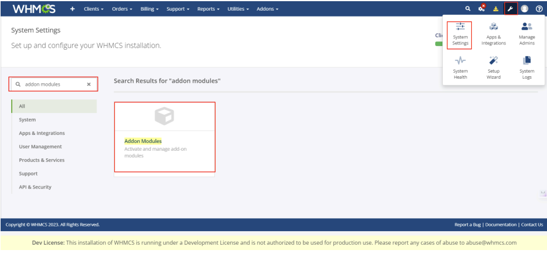

2. Find the **Openprovider SSL** addon module and click the **Activate** button. After that click the **Configure** button. Then check **Full Administrator** to permit access to the module and enter the product margin and group name. Once done, click the **Save Changes** button.

   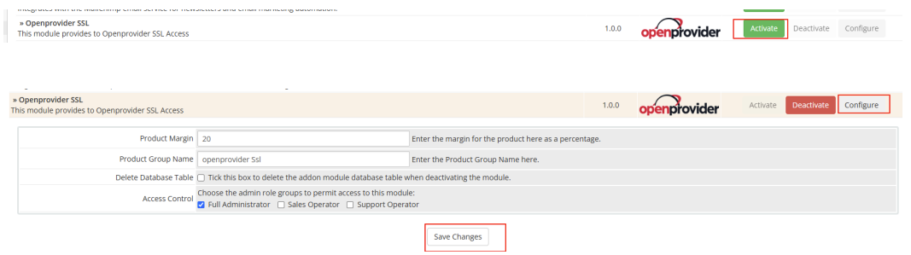

3. From the WHMCS admin dashboard, navigate to **Addons** → **Openprovider SSL**.

   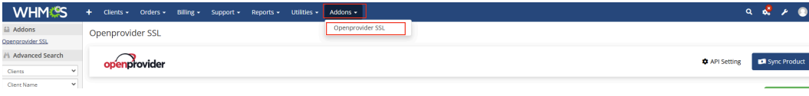

4. Go to the **API Setting** page to enter the API credentials for the API connection.

   1. Enter API URL: `https://api.openprovider.eu/v1beta`
   2. Enter Username (Openprovider username)
   3. Enter Password (Openprovider password)
   4. Click **Test Connection** and then **Save Setting**

   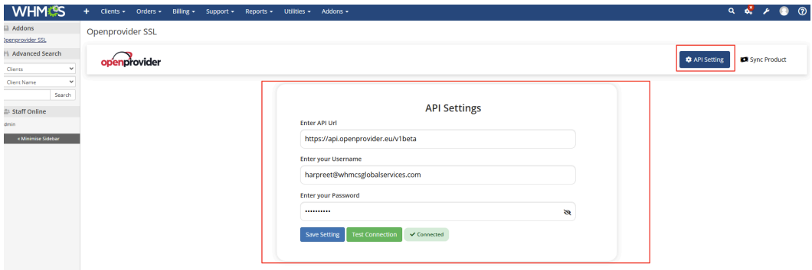

5. After adding the API credentials, go to the **Sync Product** page and click on **Sync Product**, then click on **Create Product** to create all packages in WHMCS.

   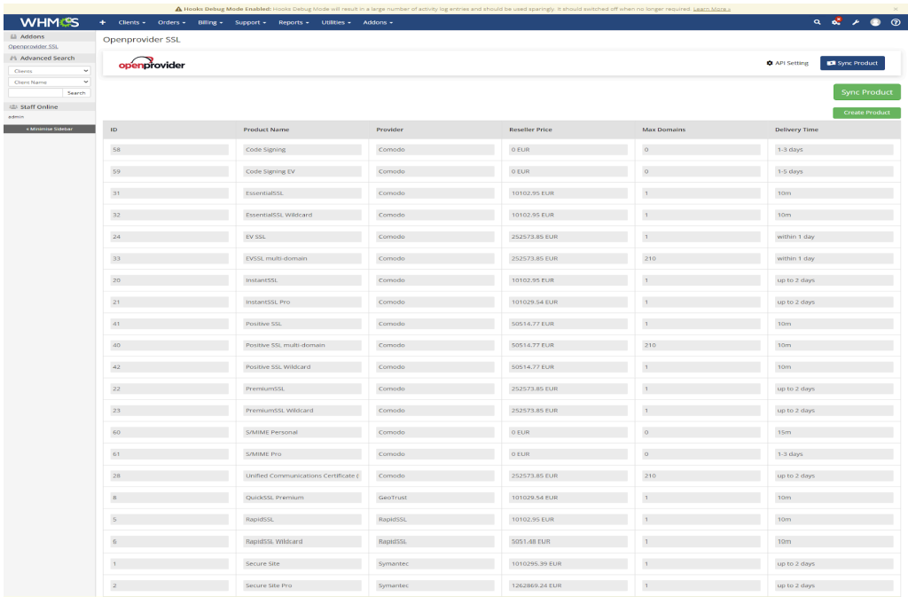

6. Under **Logs**, admin users can see all performed actions and module operations. Admins can also delete the logs.

   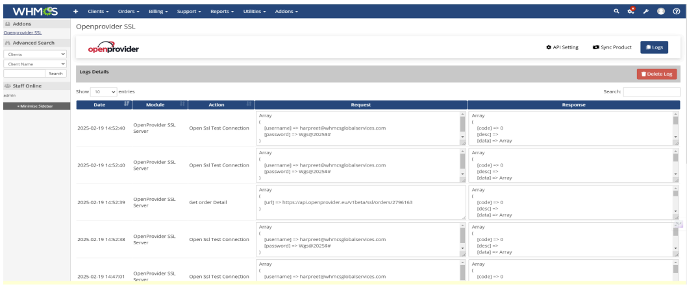

## Configure the server module

1. From your WHMCS admin area, go to **System Settings** >> **Servers**.

   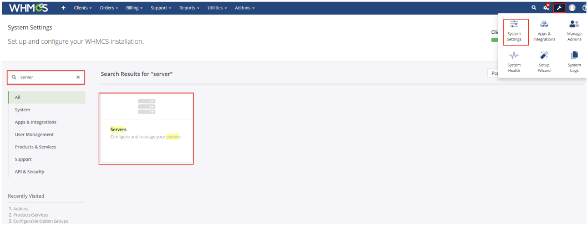

2. Click **Add New Server** and then click the **Go to Advanced Mode** button.

   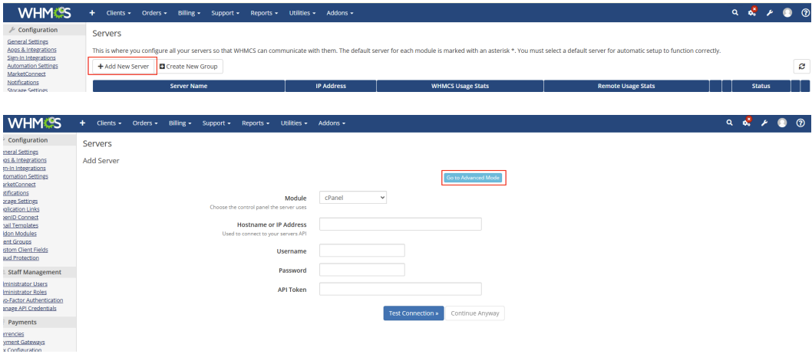

3. Add the server for API connectivity by entering the following details.

   1. Enter a name, for example `SSL Server`
   2. Enter the API URL under the **Hostname** field: `api.openprovider.eu`
   3. Select **Module** as `Openprovider SSL Certificate module`
   4. Enter **Username** as your Openprovider username
   5. Enter **Password** as your Openprovider password

   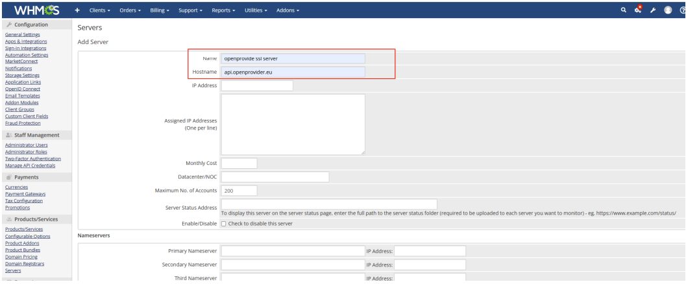

   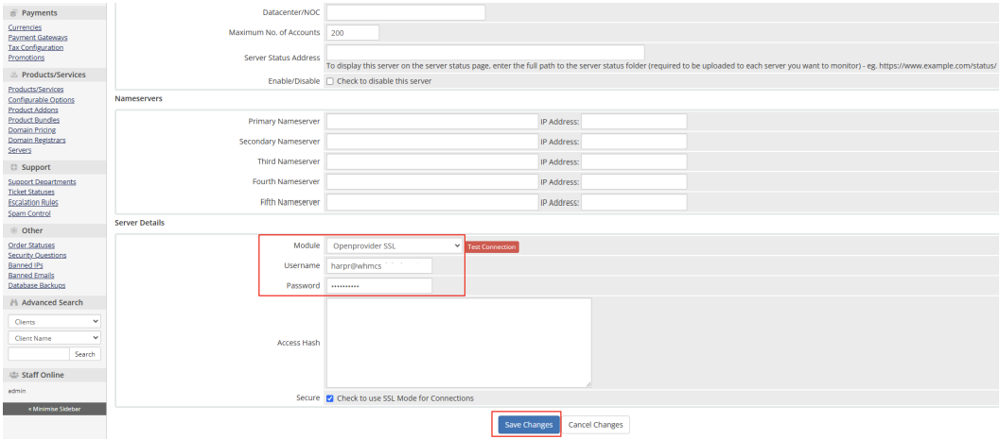

4. Click **Test Connection**.

   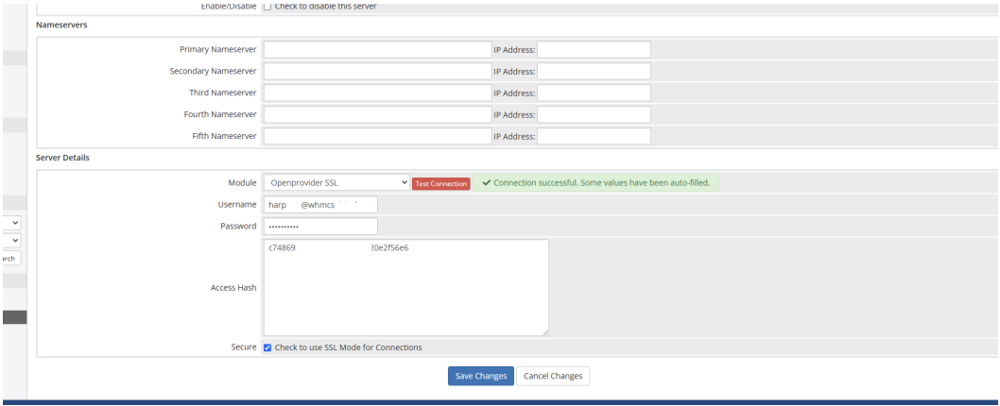

5. If everything is fine, click the **Save Changes** button to save the configuration.

6. After creating the server, click on **Create New Group**, enter a group name, assign the above created server to that group, and save the changes.

   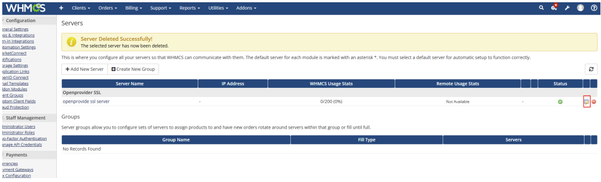

## Configure the product with server module

1. Go to **System Settings** >> **Products/Services**.

   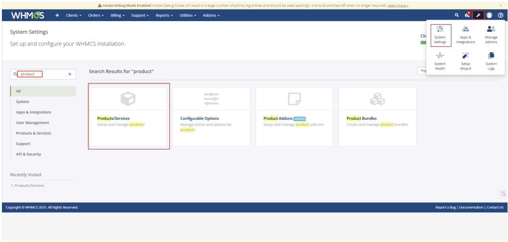

2. Edit the SSL products one by one and go to the **Module Settings** tab. Select the **Module Name** as `Openprovider SSL`.

   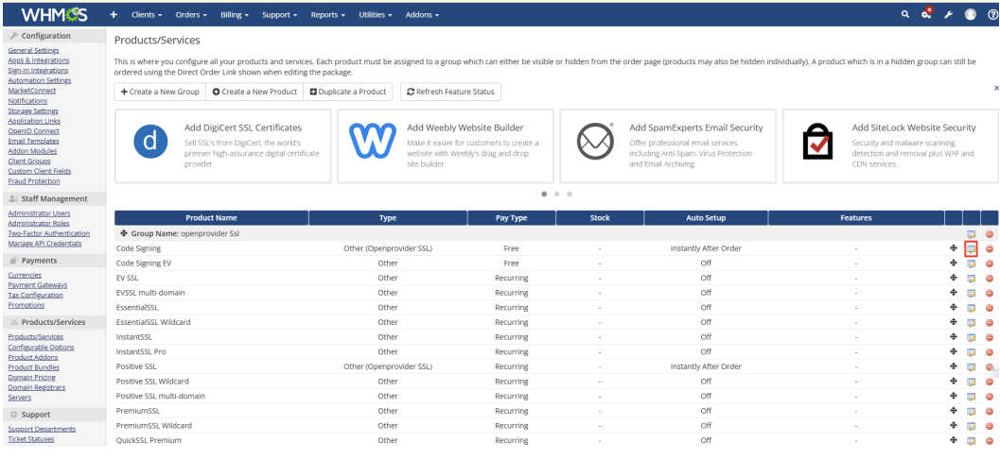

3. Set **Server Group** to the `SSL Server` group you created above for API connectivity.

4. After that you will have a configuration section to configure the module. Configure the module by choosing and entering the correct information as given below.

   1. Map specific SSL product
   2. Enable **Auto Renew**
   3. Enable **DNS Automation**
   4. Choose **Signature Hash Algorithm**
   5. Choose **Period**
   6. CSR (Optional)
   7. Make auto provision setting
   8. Click **Save Changes**

   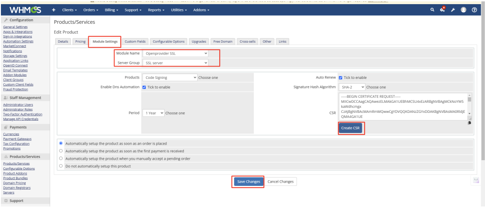

After configuring the module with the product, go to **System Settings** >> **Configurable Options**. The module will create a configurable group for the number of domains. Find that group and click the **Edit** button.

You will then see a configurable option **No. Of Domains**. Edit this option to update the price for specific billing cycles and currencies.

Your product is now ready for order.

## Manage purchased SSL certificates

### Client area

1. Log in to your client area.
2. Go to **Services** >> **My Services**.
3. Click on the purchased SSL certificate.

   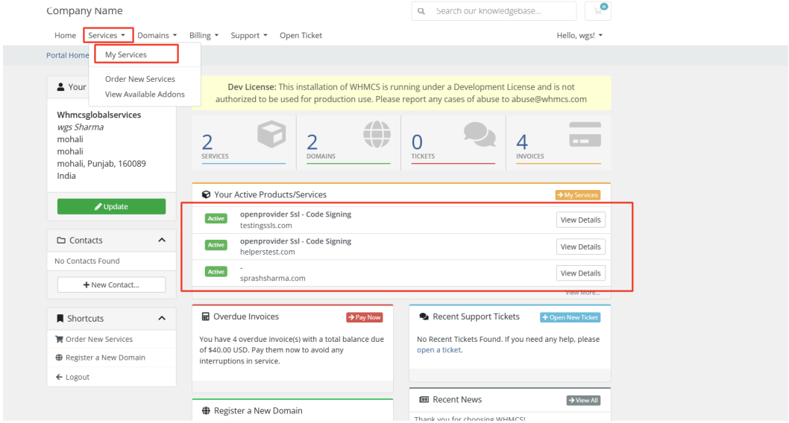

   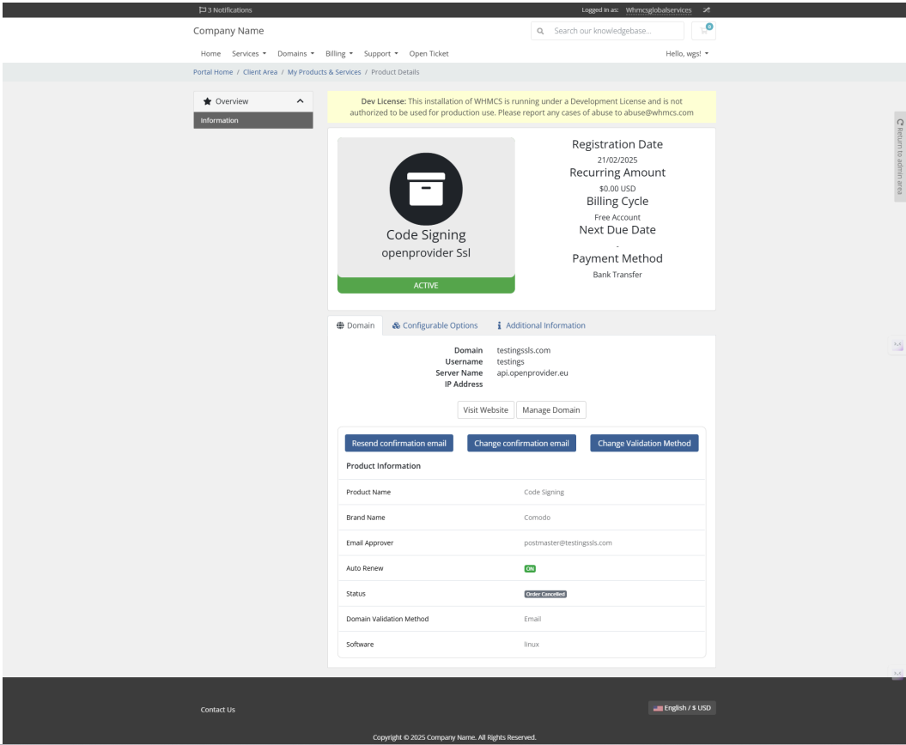

### Admin dashboard

1. Log in to your WHMCS admin area. Go to **Orders** >> **List All Orders**.

   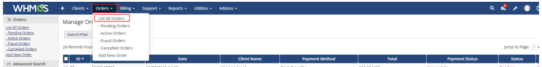

2. Click on the SSL order you want to view or manage.

   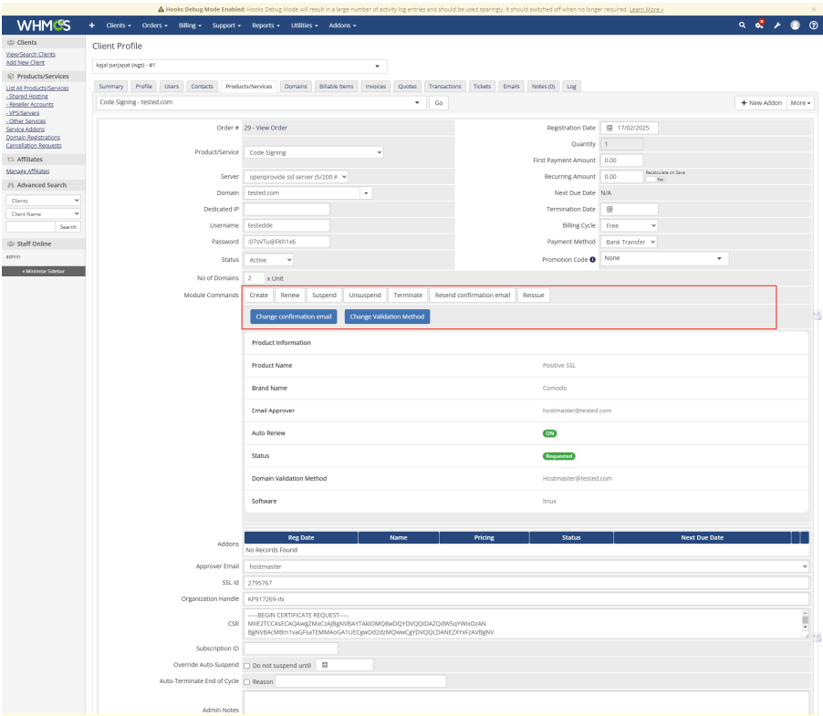
